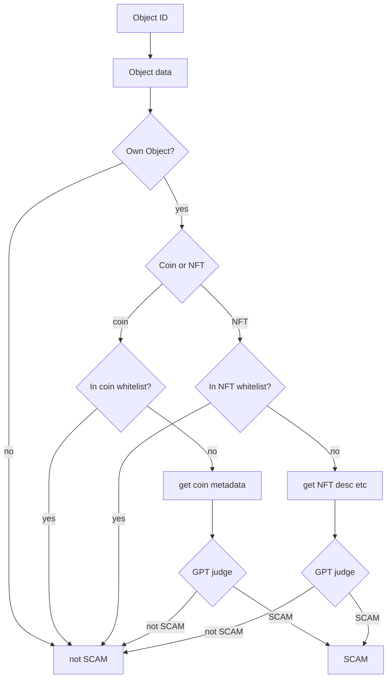

# SUI-SCAM-DETECTION

A tool to detect `SCAM` object in Sui.

## Workflow

## Configure

Whitelist in `/data/coin-list.json` and `/data/object-list.json`.

Prompts in `gpt.py`.

## Run

See `process.py`.

## Future test features
- [ ] visual model to analyze image
- [ ] (optional) llama3
- [ ] (optional) [coze](https://www.coze.com/)
